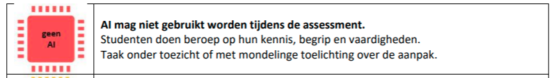

# PE01-Web Frontend Advanced - Primes


## Algemeen

Maak een applicatie waarbij je vanaf de indexpagina kan navigeren naar een spelpagina.
Voorzie deze indexpagina van een eigen opmaak, met mogelijk speluitleg.

Je kan hier eventueel gebruik maken van de algemene template.

## Spel: Priemzoeker

Maak een applicatie waarbij je een speelveld vult met exact 20 vakjes.
Deze vakjes bevatten getallen die **random** gekozen worden tussen 1 en 101.
De applicatie geeft via een duidelijke weergave weer hoeveel priemgetallen er in het speelveld zitten.

**Definitie priemgetal:**  
> Een priemgetal is een natuurlijk getal groter dan 1 dat slechts 2 natuurlijke getallen als deler heeft, namelijk 1 en zichzelf.


### Functionaliteiten
Wanneer een gebruiker een vak aanklikt, wordt weergegeven aan de hand van opmaak of het getal al dan niet een priemgetal is:
- Indien priemgetal voorzie een lichtgroene achtergrond met een groene rand
- Indien geen priemgetal voorzie een rode achtergrond met donkerrode rand

De gebruiker kan volgen of alle priemgetallen zijn geselecteerd, dit omdat de weergave van de priemgetallen wordt aangepast wanneer er een priemgetal is geselecteerd.

Je voorziet feedback als een verkeerde keuze werd gemaakt, doe dit in een voorgedefineerd HTML-element. Bv. Aangeklikt getal is geen priemgetal want dit getal heeft meer dan 2 delers nl...

- Zijn alle priemgetallen geraden, krijgt de gebruiker een melding en kan hij/zij een nieuw spel opstarten.

**Aandacht:** 

- Let erop dat reeds aangeduide getallen niet meer aanklikbaar zijn.
- Zorg ervoor dat bij het speleinde (alle priemgetallen gevonden) niet verder kan geselecteerd worden.

### Tip
Om een random getal te genereren kan je gebruik maken van een van volgende statements

```js 
// Genereert een random getal van 0(inbegrepen) tot 99(inbegrepen)
// waarin Math.random() en floating-point getal oplevert tussen 0 en 1
const random = Math.floor(Math.random() * 100)

// Genereert een random getal van 1 tot en met 100
const randomNumber = Math.ceil(Math.random() * 100)
```

Geef de pagina's een duidelijke naam en link deze met de css en js door dezelfde naam te gebruiken voor deze pagina's.

## Gebruik AI-tools
Voor deze opdracht mogen geen AI-tools gebruikt worden.


